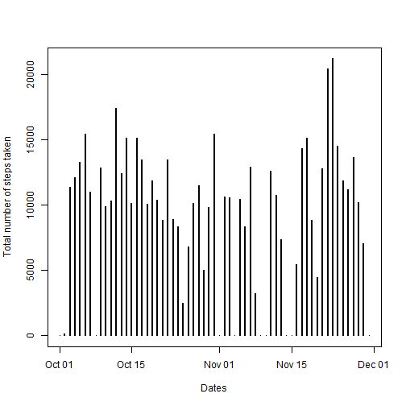

# Reproducible Research: Peer Assessment 1

## Loading and preprocessing the data

Show any code that is needed to :
1.  Load the data (i.e. read.csv())

```r
myData <- read.csv(file = "activity.csv", header = TRUE)
```


2.  Process/transform the data (if necessary) into a format suitable for your analysis

```r
myData[, 2] = as.Date(myData[, 2])
```


## What is mean total number of steps taken per day?

For this part of the assignment, you can ignore the missing values in the dataset:
1.  Make a histogram of the total number of steps taken each day.

```r
# Making a data frame with unique dates and their corresponding values:
dateWise <- as.character(unique(myData[, 2]))
dateWise <- as.data.frame(dateWise)
colnames(dateWise) <- c("Dates")

dateCount <- dim(dateWise)[1]

dateWise[, 1] <- as.Date(dateWise[, 1])

# Column for sum of the steps for every date
dateWise$Sum <- NA

# Fill Sum values for all unique dates
for (i in 1:dim(dateWise)[1]) {
    dateWise$Sum[i] <- sum(myData[myData[, 2] == as.Date(dateWise[i, 1]), 1], 
        na.rm = TRUE)
}

plot(dateWise$Dates, dateWise$Sum, type = "h", xlab = "Dates", ylab = "Total number of steps taken", 
    lwd = 2)
```

 


2.  Calculate and report the mean and median of total number of steps taken per day.


```r
# Add one column to 'dateWise' data frame
dateWise$Mean <- NA

# Creating loop to fill in Mean values corresponding to all unique dates
for (i in 1:dim(dateWise)[1]) {
    dateWise$Mean[i] <- mean(myData[myData[, 2] == dateWise[i, 1], 1], na.rm = TRUE)
}

# Head values of dateWise with 'Mean'
head(dateWise, n = 3)
```

```
##        Dates   Sum    Mean
## 1 2012-10-01     0     NaN
## 2 2012-10-02   126  0.4375
## 3 2012-10-03 11352 39.4167
```

```r
# Add one column to 'dateWise' data frame
dateWise$Median <- NA

# Creating loop to fill in Median values corresponding to all unique dates
for (i in 1:dim(dateWise)[1]) {
    dateWise$Median[i] <- median(myData[myData[, 2] == dateWise[i, 1], 1], na.rm = TRUE)
}

# Head values of dateWise with 'Median'
head(dateWise, n = 3)
```

```
##        Dates   Sum    Mean Median
## 1 2012-10-01     0     NaN     NA
## 2 2012-10-02   126  0.4375      0
## 3 2012-10-03 11352 39.4167      0
```


## What is the average daily activity pattern?

1.  Make a time series plot (i.e. type = "l") of the 5-minute interval (x-axis) and the average number of steps taken, averaged across all days (y-axis)

```r
# Get the different intervals value in a data frame
Intervals <- data.frame(unique(myData[, 3]))
colnames(Intervals) <- c("Interval")

# Column to hold average value of steps
Intervals$stepAvg <- NA

for (i in 1:dim(Intervals)[1]) {
    # Mean of all steps with the same interval
    Intervals$stepAvg[i] <- sum(myData[myData[, 3] == Intervals[i, 1], 1], na.rm = TRUE)/dateCount
}

plot(Intervals$Interval, Intervals$stepAvg, type = "l", xlab = "Interval Values", 
    ylab = "Average Number of Steps")
```

 

```r
# Intervals data frame : Intervals and Avg. of Steps for that interval
head(Intervals, n = 3)
```

```
##   Interval stepAvg
## 1        0  1.4918
## 2        5  0.2951
## 3       10  0.1148
```


2.  Which 5-minute interval, on average across all the days in the dataset, contains the maximum number of steps?

```r
# Interval value for the max. value in StepsAverage column of 'Intervals'
# data frame
maxIndex <- which.max(Intervals$stepAvg)
Intervals[maxIndex, 1]
```

```
## [1] 835
```


## Imputing missing values

Note that there are a number of days/intervals where there are missing values (coded as NA). The presence of missing days may introduce bias into some calculations or summaries of the data.
1.  Calculate and report the total number of missing values in the dataset (i.e. the total number of rows with NAs)

```r
good <- complete.cases(myData)
goodData <- myData[good, ]
# Taking the difference between the overall cases and the good cases
dim(myData)[1] - dim(goodData)[1]
```

```
## [1] 2304
```


2.  Devise a strategy for filling in all of the missing values in the dataset. The strategy does not need to be sophisticated. For example, you could use the mean/median for that day, or the mean for that 5-minute interval, etc.

```r
# Column with mean of steps corresponding to every interval, but without NA
# values in consideration
Intervals$stepAvg_NA <- NA

for (i in 1:dim(Intervals)[1]) {
    # Mean of all steps with the same interval, without NA values
    Intervals$stepAvg_NA[i] <- mean(myData[myData[, 3] == Intervals[i, 1], 1], 
        na.rm = TRUE)
}

# Intervals data frame:
head(Intervals, n = 3)
```

```
##   Interval stepAvg stepAvg_NA
## 1        0  1.4918     1.7170
## 2        5  0.2951     0.3396
## 3       10  0.1148     0.1321
```


3.  Create a new dataset that is equal to the original dataset but with the missing data filled in.

```r
# 'newData' data frame : new dataset
newData <- as.data.frame(myData)

# target : Index values of the rows with NA values
target <- which(is.na(newData[, 1]))

# Replace NA values by the corresponding avg. step value, taken over the
# interval for all days, in the row to be filled

for (i in 1:length(target)) {
    intValue <- newData[target[i], 3]  # Interval value for the row with NA value
    # Replace NA value by the Avg. of Steps for Interval value
    newData[target[i], 1] <- Intervals[Intervals$Interval == intValue, 3]
}

# 'newData' with replaced NA values :
head(newData, n = 3)
```

```
##    steps       date interval
## 1 1.7170 2012-10-01        0
## 2 0.3396 2012-10-01        5
## 3 0.1321 2012-10-01       10
```


4.  Make a histogram of the total number of steps taken each day and Calculate and report the mean and median total number of steps taken per day. Do these values differ from the estimates from the first part of the assignment? What is the impact of imputing missing data on the estimates of the total daily number of steps?

```r
dateWise$newSum <- NA
#'newSum' Column
for (i in 1:dim(dateWise)[1]) {
    dateWise$newSum[i] <- sum(newData[newData[, 2] == dateWise[i, 1], 1], na.rm = TRUE)
}

plot(dateWise$Dates, dateWise$newSum, type = "h", xlab = "Dates", ylab = "Total number of steps taken", 
    lwd = 2)
```

 

```r
# Getting 'newMean' for all dates
dateWise$newMean <- NA

for (i in 1:dim(dateWise)[1]) {
    dateWise$newMean[i] <- mean(newData[newData[, 2] == dateWise[i, 1], 1], 
        na.rm = TRUE)
}
# Head values of dateWise with 'newMean'
head(dateWise, n = 3)
```

```
##        Dates   Sum    Mean Median newSum newMean
## 1 2012-10-01     0     NaN     NA  10766 37.3826
## 2 2012-10-02   126  0.4375      0    126  0.4375
## 3 2012-10-03 11352 39.4167      0  11352 39.4167
```

```r
# Getting 'newMedian' for all dates
dateWise$newMedian <- NA

for (i in 1:dim(dateWise)[1]) {
    dateWise$newMedian[i] <- median(newData[newData[, 2] == dateWise[i, 1], 
        1], na.rm = TRUE)
}

# Head values of dateWise with 'newMedian'
head(dateWise, n = 3)
```

```
##        Dates   Sum    Mean Median newSum newMean newMedian
## 1 2012-10-01     0     NaN     NA  10766 37.3826     34.11
## 2 2012-10-02   126  0.4375      0    126  0.4375      0.00
## 3 2012-10-03 11352 39.4167      0  11352 39.4167      0.00
```

The previously filled values still hold the same value as well.

The imputing of missing data on estimates of total daily number of steps has given an overview of the expected value which could be hold by the missing values, respective to their interval values.

## Are there differences in activity patterns between weekdays and weekends?

Use weekdays() function. Use the dataset with the filled-in missing values for this part.
1.  Create a new factor variable in the dataset with two levels – “weekday” and “weekend” indicating whether a given date is a weekday or weekend day.

```r
# Adding column to 'newData' data frame to put the Day type: Weekday /
# Weekend
newData$dayType <- NA

for (i in 1:dim(newData)[1]) {
    if (weekdays(as.Date(newData[i, 2])) == "Saturday" || weekdays(as.Date(newData[i, 
        2])) == "Sunday") {
        newData$dayType[i] <- "Weekend"
    } else {
        newData$dayType[i] <- "Weekday"
    }
}

# 'newData' data frame with Day_Type column
head(newData, n = 3)
```

```
##    steps       date interval dayType
## 1 1.7170 2012-10-01        0 Weekday
## 2 0.3396 2012-10-01        5 Weekday
## 3 0.1321 2012-10-01       10 Weekday
```


2.  Make a panel plot containing a time series plot (i.e. type = "l") of the 5-minute interval (x-axis) and the average number of steps taken, averaged across all weekday days or weekend days (y-axis). 

```r
# Selecting 'Weekend' and 'Weekday' Type rows :
endIndex <- which(newData$dayType %in% "Weekend")
endRows <- newData[endIndex, ]

midIndex <- which(newData$dayType %in% "Weekday")
midRows <- newData[midIndex, ]


# 2 columns in 'Intervals', to have avg. value over their type
Intervals$Weekend <- NA
Intervals$Weekday <- NA

# Calculating averages for Weekend part:
for (i in 1:dim(Intervals)[1]) {
    Intervals$Weekend[i] <- mean(endRows[endRows[, 3] == Intervals[i, 1], 1])
}

# Calculating averages for Weekday part:
for (i in 1:dim(Intervals)[1]) {
    Intervals$Weekday[i] <- mean(midRows[midRows[, 3] == Intervals[i, 1], 1])
}

par(mfrow = c(2, 1))
plot(Intervals$Interval, Intervals$Weekend, type = "l", xlab = "Interval", ylab = "Number of steps", 
    main = "Weekend")

plot(Intervals$Interval, Intervals$Weekday, type = "l", xlab = "Interval", ylab = "Number of steps", 
    main = "Weekday")
```

 

